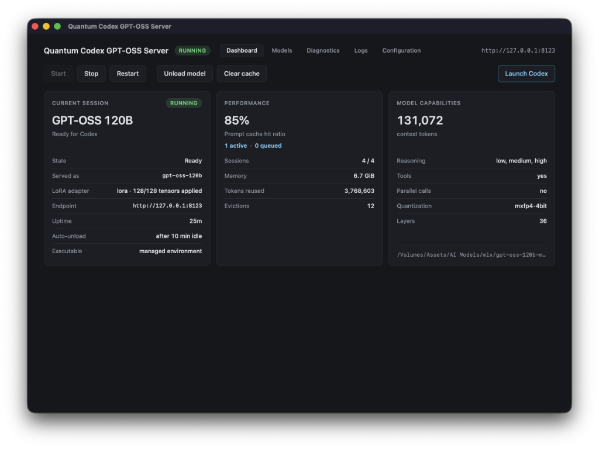
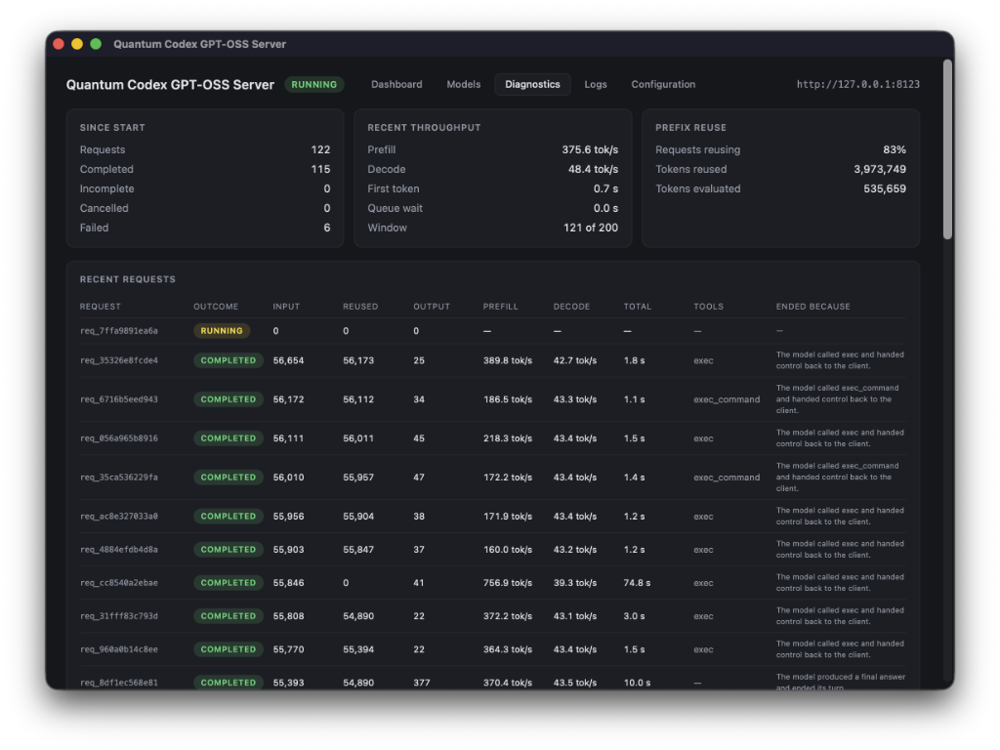

# Codex GPT-OSS Server



**Run OpenAI Codex locally with GPT-OSS models.**

Codex GPT-OSS Server provides a native backend that makes GPT-OSS (Coder/20B/120B) work seamlessly with Codex through MLX. Instead of a generic inference server, it implements the exact protocols Codex expects, including Responses API, model metadata, reasoning continuity, and tool routing—all wrapped in a simple macOS app that handles the runtime, models, and server for you.

**No cloud dependencies, no API keys, no telemetry.** Just open the app, add your model, start the server, copy the Codex command, and get coding.

> **Version 1.0.1** · tested with Codex CLI **0.147.0** on Apple Silicon macOS

<span style="color:orange;">**Currently for Apple Silicon / MLX only. Let me now if you'd like a Linux/Windows version.**</span>

---

## What QCS Does Best

### Codex works as expected with local GPT-OSS models

Most GPT-OSS solutions are generic inference servers that flatten important protocol details. QCS solves this by being a **native Codex backend**, ensuring native integration with:

- **Responses API** implementation instead of Chat Completions
- **Reasoning continuity** preserved across tool turns
- **Proper tool namespace handling** (critical for MCP workflows)
- **Automatic prompt prefix reuse** to save 90%+ of prefills
- **Codex-native model metadata** with base instructions and reasoning levels

### Performance and features

- **Built-in 20B and 120B support**: Download models directly or use existing weights
- **Hot LoRA loading**: Add adapters at runtime
- **Smart downloads**: Check free space, resume interrupted downloads
- **External drive friendly**: Store models anywhere, track disconnected volumes
- **Per-model settings**: Configure reasoning effort, names, context independently
- **Automatic model lifecycle**: Models unload after idle periods, reload transparently
- **One-click Codex launch**: Get the exact command ready to paste in terminal
- **Persist configuration**: Generate `config.toml` for CLI/VS Code without touching cloud setup
- **Local-first privacy**: All processing happens on your Mac; diagnostics exclude actual content

---

## Get Started in 3 Minutes

### 1. Install and launch the app

Open `Codex GPT-OSS Server.dmg`, drag **Codex GPT-OSS Server.app** to your Applications folder, then launch it.

On first run, click **"Install the runtime"**. The app sets up a managed Python/MLX environment automatically—no Homebrew or system Python required.

Click **"Start"**. The daemon can run without any model loaded, which is completely normal.

### 2. Add your model

Go to the **Models** tab.

For GPT-OSS Coder, 20B or 120B, you can:
- Click **Download** to fetch the model
- Click **Locate…** if you already have the weights on disk

For other models, use **Import existing…** or **Scan roots** to find existing libraries

You can change the download location anytime, and store large models on an external SSD.

### 3. Launch Codex

Back on the **Dashboard**, click **Launch Codex**.

Select your model. QCS generates the complete command with model, reasoning settings, and provider configuration:

```sh
tcodex \
  -c model="gpt-oss-120b" \
  -c model_reasoning_effort="high" \
  -c model_provider="qcs" \
  -c model_providers.qcs.name="QCS" \
  -c model_providers.qcs.base_url="http://127.0.0.1:8123/v1" \
  -c model_providers.qcs.wire_api="responses" \
  -c 'model_providers.qcs.auth={command="echo", args=["local"]}'
```

Copy-paste this into your terminal. Codex now uses your local GPT-OSS model through QCS, no cloud required, and your existing Codex setup remains unchanged.

---

## Set Up Persistent Access

If you want QCS available globally in Codex CLI or VS Code:

```sh
# One-liner for persistent config
qcs codex launch --config
```

This generates a `config.toml` fragment you can add to `~/.codex/config.toml`:

```toml
model = "gpt-oss-120b"
model_reasoning_effort = "high"
model_provider = "qcs"

[model_providers.qcs]
name = "QCS"
base_url = "http://127.0.0.1:8123/v1"
wire_api = "responses"
auth.command = "echo"
auth.args = ["local"]
```

> **Note**: The `auth` configuration isn't for server security, QCS binds to localhost only. In Codex 0.147, this setup enables dynamic model catalog updates. Without it, Codex uses its default model list.

---

## Model Selection Guide

The Models tab groups these into three sections, in the order they are offered:
**Optimized Models**, **Stock Models**, and **Other Models**, the last being
whatever you imported or a root scan found.

### GPT-OSS Coder, optimized

A **gpt-oss-120b** version focused on improving practical coding-agent behavior in repository-level software engineering tasks.


It digs deeper into the repository, follows evidence to the root cause, and keeps iterating until the fix holds under real tests instead of stopping at a plausible-looking patch.

- Fixes the bug, not the symptom : traces the actual defect, not the first thing that looks broken
- Inspects more before editing, and re-runs tests after : more reads, more checks, fewer false successes
- Emits tool calls the harness can actually run : dramatically fewer rejected calls
- Revisits files when new evidence appears
- Reasons about state and invariants across components
- Continues iterating when the first implementation is incomplete
- Ends its turns with a real report of what was done — no empty summaries, no truncated turns

The fine-tune also significantly reduced malformed JSON arguments.

See the [model card](https://huggingface.co/exalandru/GPT-OSS-Coder-MLX).

### GPT-OSS 120B
Choose this when you need advanced features:

- Essential for namespaced tools (MCP-style, multi-agent)
- Better at routing tools with same names across namespaces
- Tests show correct namespace handling (20B isn't reliable for this)
- Handles ~60.8 GiB mxfp4 build

### GPT-OSS 20B
Perfect for everyday coding tasks using standard shell/file tools:

- Quick loading (~12.8 GiB mxfp4)
- Great for ordinary coding, reasoning, and long sessions
- Handles basic tool flows efficiently

> QCS provides conservative normalization for 20B when disambiguation is possible, but it never guesses between multiple candidates.

---

## System Requirements

| Requirement | Details |
|-------------|---------|
| **Platform** | macOS on Apple Silicon |
| **Memory** | 24 GB recommended for 20B; 96 GB+ recommended for 120B |
| **Codex CLI** | Tested with version **0.147.0** |
| **Model format** | GPT-OSS 20B or 120B in MLX mxfp4 format |
| **Network** | Required for first-time setup and model downloads |

The app itself is ~58 MB and sets up a ~387 MB managed runtime—no external dependencies needed.

---

## How QCS Differs from Generic Servers

QCS is **intentionally not a generic OpenAI-compatible inference server**. It's purpose-built as a **Codex backend for GPT-OSS** with full protocol fidelity.

Key differences maintained:

- Uses **Responses API**, not Chat Completions
- Preserves **reasoning as a first-class citizen** across tool turns
- Supports **Harmony channels** (`analysis`, `commentary`, `final`)
- Maintains **separate tool names and namespaces** (critical for MCP)
- Handles `<|call|>` as turn delimiter per GPT-OSS specification
- Provides **Codex-native metadata** via `/v1/models` endpoint
- Includes **base instructions, reasoning metadata, and context** in responses

Generic shims that flatten these details will appear to work but lose:
- Reasoning continuity
- Correct tool routing
- Prompt prefix reuse
- Model-specific instructions

The supported path is narrow but precisely defined:

```
Frontend:       Codex CLI 0.147.0
Model family:   GPT-OSS 20B/120B mxfp4
Protocol:       OpenAI Harmony
Runtime:        MLX
Platform:       macOS Apple Silicon
Wire protocol:  Responses API (Codex-compatible)
```

While other Responses-compatible clients might work, the contract is specifically with Codex.

---

## How Prompt Caching Works



Codex replays the conversation prefix on every turn. QCS manages this intelligently:

- Repeated prefixes are **reused instead of recomputed**
- Cache is automatically cleared when the model unloads
- Lifetime hit/miss counters available in diagnostics

In measurements, prefill latency improved dramatically across three turns:

```
1.56s → 0.16s → 0.12s
```

> Cache is exact-prefix only. Any divergence forces a full prefill, as GPT-OSS sliding-window layers make partial cache invalidation unsafe.

---

## Desktop App Components

The macOS app serves as the control plane for your local QCS daemon:

- **Dashboard**: Server status, resident model, capabilities summary, inference metrics, cache status, start/stop controls
- **Models**: Built-in catalog, download/import tools, storage location settings, per-model configuration
- **Diagnostics**: Runtime health, lifecycle events, system metrics
- **Logs**: Full-height server logs with search capabilities
- **Configuration**: Named server profiles and global settings

The daemon runs independently of the GUI. Closing the window doesn't stop the server; reopening the app reestablishes the connection.

---

## Terminal Commands Reference

All app functionality is available via the command line using either `quantum-codex-server` or its alias `qcs`.

### Core commands

| Command | Description |
|---------|-------------|
| `qcs serve [--profile NAME]` | Start the inference server |
| `qcs status` | Show server runtime information |
| `qcs doctor` | Check environment, runtime, and model readiness |

### Model management

| Command | Description |
|---------|-------------|
| `qcs models list` | Show available models |
| `qcs models scan` | Discover models without adding them |
| `qcs models import PATH` | Add existing model |
| `qcs models download REPO` | Download from Hugging Face |
| `qcs models forget SLUG` | Remove model from catalog |
| `qcs models roots` | List scan roots |
| `qcs models inspect SLUG` | Show model details |
| `qcs models unload` | Unload currently loaded model |
| `qcs models storage [PATH]` | Show/change download location |
| `qcs models config SLUG [FIELD=VALUE ...]` | Configure model settings |

### Prompt cache

| Command | Description |
|---------|-------------|
| `qcs cache stats` | Show cache hit/miss counters |
| `qcs cache clear` | Reset cache statistics |

### Server profiles

| Command | Description |
|---------|-------------|
| `qcs profiles list` | List available profiles |
| `qcs profiles show NAME` | Show profile details |
| `qcs profiles set NAME` | Switch active profile |
| `qcs profiles add NAME CONFIG` | Create new profile |
| `qcs profiles remove NAME` | Delete profile |
| `qcs profiles default` | Show default profile |

### Codex integration

| Command | Description |
|---------|-------------|
| `qcs codex launch [PROMPT]` | Generate one-shot Codex command |
| `qcs codex launch --config` | Generate persistent `config.toml` fragment |

---

## What's Been Validated

QCS has been tested against **real Codex 0.147 and real GPT-OSS weights** across many scenarios:

✅ Streaming and non-streaming `/v1/responses` endpoints  
✅ Deterministic SSE event ordering  
✅ Reasoning continuity across multiple tool turns  
✅ Codex-native `/v1/models` metadata delivery with base instructions  
✅ Sequential function calls with tool results  
✅ Namespaced tools (MCP-style)  
✅ Multi-agent workflows (`spawn_agent → wait_agent`)  
✅ Prompt prefix reuse with measurable latency improvements  
✅ Cancellation and client disconnect handling  
✅ Streaming heartbeat for long-running prefills  
✅ First-run managed runtime bootstrap  
✅ Model import/download/library with external volume support  
✅ Idle unloading and transparent reload  
✅ Long-running sessions with GPT-OSS 120B without tool-loop failures  

---

## Known Limitations

### MCP integration - partial support

Codex exposes MCP servers as tool namespaces that QCS carries correctly. A real MCP server was successfully accessed through Codex. However, **non-interactive `codex exec` cancels MCP tool calls** due to client-side approval flows. **Interactive MCP workflows** remain unvalidated.

### `tool_search` — blocked by Codex

Codex 0.147 doesn't expose `tool_search` to custom providers even when enabled. QCS doesn't implement workarounds that the client doesn't support.

### Current constraints

- No encrypted reasoning replay support; encrypted-only items skipped on replay
- No structured output, provider-hosted tools, or `web_search` implementation
- Harmony protocol emits one tool call per assistant turn (`<|call|>` ends turns)
- Only one resident model at a time
- Exact-prefix caching only; divergence forces full recomputation
- Diagnostics are in-memory; don't survive daemon restarts
- No diagnostic export or benchmark commands yet
- No long-term resource-soak guarantee documented

---

## Building from Source

Only needed for development—regular users should install the pre-built app.

```sh
make install       # Set up environment and dependencies
make doctor        # Validate your setup
make dev-server    # Start development server
make dev-desktop   # Launch development desktop app
```

---

## Development and CI Pipeline

```sh
make ci
```

Runs comprehensive validation without requiring actual model weights:
- Python linting and type checking
- JavaScript type checking and tests
- Production build validation
- Rust formatting and linting
- Cargo test suite

A green CI run confirms protocol, configuration, library, and UI logic—but not that a particular machine can run 20B or 120B models successfully.

---

## Privacy and Data Handling

Everything stays on your machine:
- **No telemetry** or outbound network requests
- **No cloud dependencies** beyond conscious model downloads
- **Diagnostics only** record operational metadata (counters, tool names, outcomes)
- **Content is never logged**: prompts, reasoning text, tool arguments, tool outputs are excluded

Your data remains yours.

---

## License

MIT
