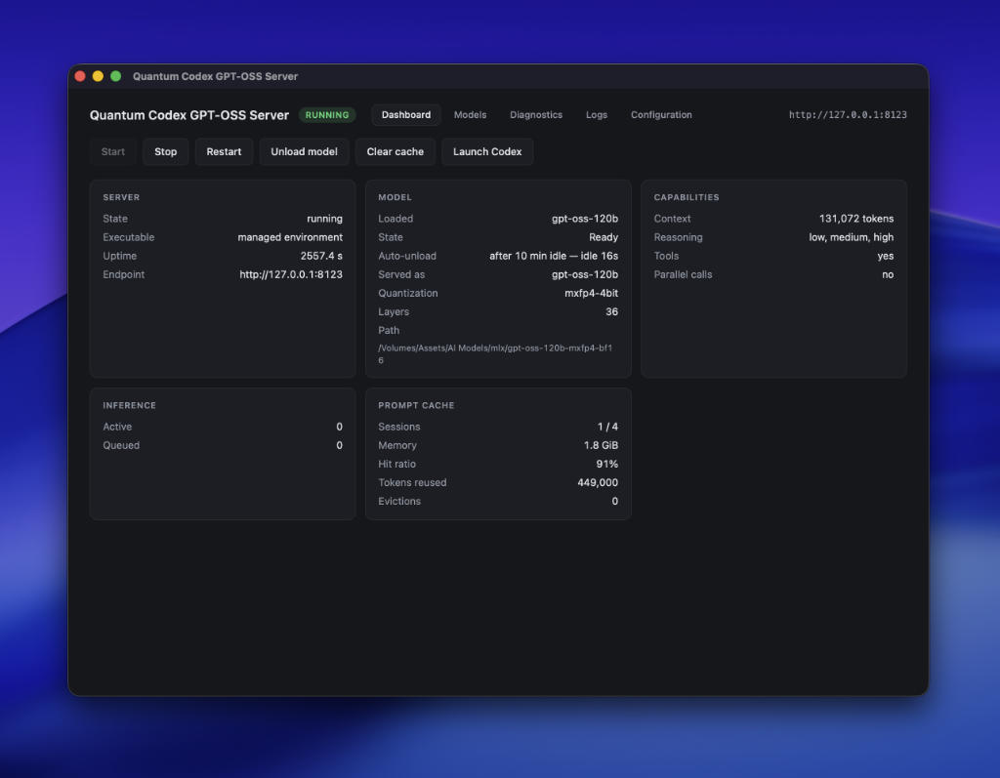
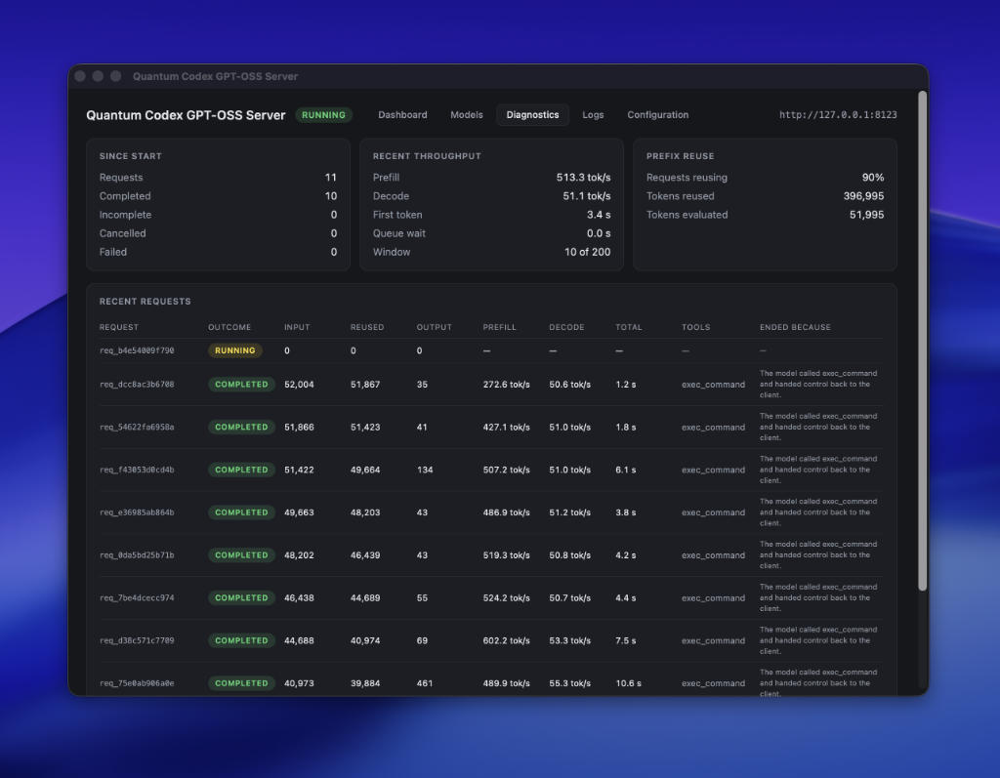

# Quantum Codex GPT-OSS Server




**Run OpenAI Codex locally against GPT-OSS on your Apple Silicon Mac.**

Quantum Codex GPT-OSS Server is a native Codex backend for **GPT-OSS 20B and 120B on MLX**. It gives Codex the protocol, model metadata, reasoning continuity, tool routing and prompt reuse it expects, with a macOS app that handles the runtime, models and server for you.

**No cloud model, no API key, no telemetry.** Start the app, download or locate a model, start the server, copy the generated Codex command, and work normally.

> **Version 1.0.1** · tested with Codex CLI **0.147.0** on Apple Silicon macOS.

---

## Highlights

- **Codex-native API** - implements the Responses API and Codex's own `/v1/models` metadata contract, including GPT-OSS base instructions and reasoning levels.
- **Real agent-loop support** - reasoning survives tool turns, tool results replay correctly, and namespaced tools are preserved instead of flattened into text.
- **Prompt cache reuse** - repeated Codex turns reuse the shared prompt prefix instead of paying full prefill cost every time. In a measured 3-turn session, prefill dropped from **1.56 s → 0.16 s → 0.12 s**.
- **Automatic model lifecycle** - the daemon can stay running with no model loaded. GPT-OSS loads on demand and can unload automatically after an idle timeout.
- **20B and 120B built in** - download, locate or import the supported GPT-OSS models directly from the Models tab.
- **Resumable downloads** - downloads preflight disk space, can be cancelled, keep partial data and resume instead of starting over.
- **External-drive friendly** - choose where models are downloaded; unplugged model volumes are reported as `MISSING_VOLUME` rather than treated as deleted.
- **Per-model settings** - configure reasoning effort, served name, context and other model-specific values independently for 20B and 120B.
- **Launch Codex without touching your cloud setup** - the app generates an exact one-shot `codex` command, or a persistent `config.toml` fragment for the CLI / VS Code extension.
- **Local macOS control plane** - Dashboard, Models, Diagnostics, Logs and Configuration in one app.
- **Private by design** - requests stay on your Mac. Diagnostics do not record prompts, reasoning text, tool arguments or tool outputs.

---

## Quick start

### 1. Install and start the app

Open `Codex GPT-OSS Server.dmg`, drag **Codex GPT-OSS Server.app** to Applications, then launch it.

On first run, click **Install the runtime**. The app builds its own managed Python/MLX environment under Application Support. You do not need Homebrew, a system Python environment or a development checkout.

Then press **Start**. The daemon can run with no model loaded; this is normal.

### 2. Add a model

Open the **Models** tab.

For GPT-OSS 20B or 120B you can:

- click **Download** to fetch it;
- click **Locate…** if you already have the model on disk;
- use **Import existing…** or **Scan roots** for an existing library.

The download directory is configurable, so large models can live on an external SSD instead of your boot disk.

### 3. Launch Codex

Return to the **Dashboard** and click **Launch Codex**.

Choose the model you want to use. QCS generates the complete command, including the model, reasoning effort and provider configuration.

It looks like this:

```sh
codex \
  -c model="gpt-oss-20b" \
  -c model_reasoning_effort="medium" \
  -c model_provider="qcs" \
  -c model_providers.qcs.name="QCS" \
  -c model_providers.qcs.base_url="http://127.0.0.1:8123/v1" \
  -c model_providers.qcs.wire_api="responses" \
  -c 'model_providers.qcs.auth={command="echo", args=["local"]}'
```

Copy it into Terminal. Codex now uses your local GPT-OSS model through QCS.

That one-shot form **does not modify `~/.codex/config.toml`**, so your normal cloud Codex setup remains untouched.

---

## Persistent Codex / VS Code configuration

If you want QCS to be available globally in Codex CLI or in the VS Code extension, use the persistent form instead:

```sh
quantum-codex-server codex launch --config
```

or, equivalently:

```sh
qcs codex launch --config
```

It prints a `config.toml` fragment built from the same model and per-model settings as the one-shot command:

```toml
model = "gpt-oss-20b"
model_reasoning_effort = "medium"
model_provider = "qcs"

model_providers.qcs.name = "QCS"
model_providers.qcs.base_url = "http://127.0.0.1:8123/v1"
model_providers.qcs.wire_api = "responses"
model_providers.qcs.auth.command = "echo"
model_providers.qcs.auth.args = ["local"]
```

Append that fragment to your own `~/.codex/config.toml` when you want the persistent setup.

The `auth` entry is not server security. QCS binds to loopback and has no authentication. Codex 0.147 uses command-backed auth as the gate that enables online model-metadata refreshes; without it, Codex does not fetch QCS's `/v1/models` catalogue and falls back to its bundled defaults.

---

## Which model should I use?

### GPT-OSS 20B

Use the **20B** for the fast everyday coding loop when your task mostly uses ordinary Codex shell/file tools.

- much lighter to load;
- about **12.8 GiB** in the tested mxfp4 build;
- good for ordinary coding, reasoning and long sessions.

### GPT-OSS 120B

Use the **120B** when you need **namespaced tools**, including MCP-style namespaces, multi-agent flows or Codex apps.

- about **60.8 GiB** in the tested mxfp4 build;
- materially heavier, but handles real tool namespaces correctly;
- recommended when multiple namespaces may expose the same tool name.

Measured namespace-routing tests showed the 120B addressing namespaces correctly while the 20B did not. QCS includes conservative recipient normalisation for the 20B when a correction is structurally unambiguous, but it never guesses between multiple candidates.

---

## Model management

### Download from Hugging Face

Use the **Download** button on a built-in model card, or from a terminal:

```sh
quantum-codex-server models download mlx-community/gpt-oss-20b-MXFP4-Q8
```

Downloads:

- check free space on the configured destination volume;
- report real progress;
- can be cancelled;
- keep partial files;
- resume from retained bytes.

The 120B download is roughly **61 GiB**.

### Import or locate an existing model

```sh
quantum-codex-server models import ~/models/gpt-oss-20b-mxfp4-bf16
```

**Locate…** attaches a directory to a known catalogue entry and validates that it is the expected model. A 20B directory will not silently become the 120B entry.

**Scan roots** discovers compatible models without moving them.

### Choose the download location

```sh
quantum-codex-server models storage ~/models
```

Run it without a path to show the current destination.

Existing models are not moved when you change the download location; it affects future downloads.

### Configure each model independently

```sh
quantum-codex-server models config gpt-oss-120b
quantum-codex-server models config gpt-oss-120b reasoning_effort=high
quantum-codex-server models config gpt-oss-120b max_output_tokens=
```

The desktop app exposes the same configuration through **Models → Configure…**.

For GPT-OSS, reasoning effort is `low`, `medium` or `high`. The effective value is automatically included in the generated Codex command/configuration.

---

## Idle model unload

A loaded model does not need to occupy memory forever.

By default, QCS releases the resident model after **10 minutes without inference activity**. The daemon stays alive, `/v1/models` continues to answer, and the next Codex request reloads the model transparently.

Manual unload is also available:

```sh
quantum-codex-server models unload
```

Set the idle timeout to `0` if you want a model to remain resident indefinitely.

In a real 20B witness, idle unload reduced process RSS from about **13.7 GB to 0.6 GB**, while keeping the daemon online; the next request reloaded and completed normally.

---

## Requirements

| | |
| --- | --- |
| Platform | macOS on Apple Silicon |
| Memory | 24 GB for GPT-OSS 20B; 96 GB recommended for GPT-OSS 120B |
| Codex | CLI **0.147.0** - the version currently validated |
| Models | GPT-OSS 20B or 120B, MLX mxfp4 |
| Network | Required for first-run runtime setup and model downloads |

The packaged app carries the `uv` bootstrap binary and builds its own managed runtime. The app bundle itself is about **58 MB**; the managed runtime is roughly **387 MB** before model weights.

---

## What QCS is doing differently

QCS is intentionally **not a generic OpenAI-compatible inference server**. It is a Codex backend for GPT-OSS.

Codex and GPT-OSS both have protocol details that generic shims tend to flatten away:

- Codex uses the **Responses API**, not Chat Completions;
- reasoning is a first-class item that must survive across tool turns;
- GPT-OSS uses **Harmony** channels (`analysis`, `commentary`, `final`);
- Codex keeps tool `name` and `namespace` separate;
- `<|call|>` ends a GPT-OSS tool-call turn even though it is not in the model's normal EOS list;
- Codex fetches model metadata from `GET /v1/models` using its own `ModelsResponse` schema;
- QCS supplies Codex-native `base_instructions`, reasoning metadata and context information there.

If these details are flattened into a generic chat-style exchange, Codex may still look superficially functional while losing reasoning continuity, tool routing, prompt reuse or model-specific instructions.

The supported path is deliberately narrow:

```text
Harness        Codex CLI 0.147.0
Model family   GPT-OSS 20B / 120B, mxfp4
Model protocol OpenAI Harmony
Runtime        MLX
Platform       macOS, Apple Silicon
Wire protocol  Responses API as Codex uses it
```

If another Responses-compatible client happens to work, that is useful, but it is not the product contract.

---

## Prompt cache



Codex replays the conversation prefix on every turn. QCS keeps compatible prompt/KV state so repeated prefixes can be reused instead of recomputed.

A measured three-turn session showed prefill latency dropping from:

```text
1.56 s → 0.16 s → 0.12 s
```

The cache is exact-prefix only. If the prompt diverges, the request runs cold; GPT-OSS's sliding-window layers make arbitrary cache trimming unsafe.

Resident prompt cache is cleared when the model unloads. Lifetime hit/miss/reuse counters remain available for diagnostics.

---

## Desktop app

The macOS app is the control plane for the local daemon:

- **Dashboard** - server state, resident model, capabilities, inference and prompt-cache status; Start/Stop/Restart, model unload and Launch Codex.
- **Models** - built-in 20B/120B catalogue, download/import/locate/scan, download location and per-model settings.
- **Diagnostics** - runtime and lifecycle diagnostics.
- **Logs** - full-height server log view.
- **Configuration** - named server profiles and server-wide settings.

The daemon lifetime is independent from the GUI. Closing the window does not have to stop a healthy server; reopening the app can reattach to it.

---

## Terminal reference

Everything available in the app can also be driven from the CLI.

| Command | Purpose |
| --- | --- |
| `serve [--profile NAME]` | Run the inference server |
| `status` | Report on the running server |
| `models list \| scan \| import \| download \| forget \| roots \| inspect` | Model library |
| `models unload` | Release the resident model while keeping the server running |
| `models storage [PATH]` | Show/change the model download location |
| `models config SLUG [field=value …]` | Per-model settings |
| `requests` | Recent request diagnostics |
| `cache stats \| clear` | Prompt-cache counters and reset |
| `profiles list \| show \| set \| add \| remove \| default` | Named server configurations |
| `codex launch [PROMPT]` | Print the one-shot Codex command |
| `codex launch --config` | Print the persistent `config.toml` fragment |
| `doctor` | Environment, runtime and model readiness |

The executable is installed under two names:

- `quantum-codex-server` - canonical name;
- `qcs` - short alias for the same program.

For example:

```sh
qcs status
qcs models list
qcs codex launch
```

The server binds to `127.0.0.1` by default.

---

## What has been validated

The following have been exercised against real Codex 0.147 and real GPT-OSS weights unless noted otherwise:

- streaming and non-streaming `/v1/responses`;
- deterministic SSE event ordering;
- reasoning continuity across tool turns;
- Codex-native `GET /v1/models` and `base_instructions` delivery;
- sequential function calls;
- namespaced tools;
- real multi-agent `spawn_agent → wait_agent` flow;
- prompt-prefix reuse;
- cancellation and client disconnect handling;
- streaming heartbeat during long prefills;
- packaged first-run managed-runtime bootstrap;
- model import/download/library/external-volume states;
- idle model unload and transparent reload;
- long real Codex runs on GPT-OSS 120B without the earlier tool-loop termination failure.

---

## Known limitations

### MCP - partial

Codex exposes MCP servers as tool namespaces, and QCS carries those namespaces correctly. A real MCP server was reached through Codex. In non-interactive `codex exec`, however, the client cancelled the MCP tool call because of its own approval flow. Interactive Codex MCP remains unvalidated.

### `tool_search` - blocked by Codex 0.147 custom-provider behavior

Codex 0.147 does not currently expose `tool_search` to this custom provider, even when the feature is enabled. QCS does not invent a deferred-tool protocol that the client does not exercise.

### Exhaustive-task instruction following is not guaranteed

QCS supplies GPT-OSS with persistence/completion instructions, but prompting cannot guarantee that a model's self-reported coverage is truthful. In controlled repository-wide audit tests, GPT-OSS 120B sometimes declared exhaustive completion after inspecting only part of the requested surface. For genuinely exhaustive work, use a task/skill with an independently checkable completion criterion.

### Other constraints

- No encrypted-reasoning replay support; encrypted-only reasoning items are skipped on replay.
- No structured output, provider-hosted tools or `web_search` implementation.
- Harmony emits one tool call per assistant turn because `<|call|>` ends the turn.
- One inference model is resident at a time.
- Prompt reuse is exact-prefix only.
- Diagnostics are in memory and do not survive daemon restart.
- No diagnostic bundle export or built-in benchmark command yet.
- No multi-hour resource-soak guarantee has been established.

---

## From source

Only needed if you are developing QCS rather than installing the app.

```sh
make install       # uv sync + npm install
make doctor        # environment, runtime and model readiness
make dev-server    # start the development server
make dev-desktop   # start the Tauri desktop app
```

---

## Development and CI

```sh
make ci
```

runs the full non-model validation gate:

- `ruff`;
- Python tests;
- TypeScript typecheck;
- `vitest`;
- Vite production build;
- staging of the bundle resources Tauri's build script validates;
- `cargo fmt --check`;
- `clippy`;
- Rust tests.

CI does **not** download or run GPT-OSS weights. A green CI run validates protocol/configuration/library/UI logic, not whether a particular machine can successfully run a 20B or 120B model.

---

## Privacy

Everything runs on your Mac. There is no telemetry and no outbound request except downloads you explicitly start.

Request diagnostics record operational metadata such as counters, tool names and outcomes - **not prompts, reasoning text, tool arguments or tool outputs**.

---

## License

MIT
